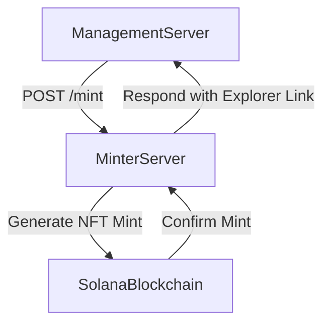

# solyd_soulbound_nft_minter

# 🌟 SOLYD NFT Minter Server

Check out the mmanager server @ https://github.com/solydstore/manager_server_hackathon.git

## 🚀 Features

* Mint **Soulbound NFTs** automatically upon request
* Secure API access with API secret
* Integrated with **Metaplex UMI SDK**
* Built using **mpl-core** and **Oracle Plugin**
* Fast mint confirmation via custom **Solana RPC**
* Collection-linked minting

---

## 🛠️ Tech Stack

| Tool / Library   | Purpose                             |
| :--------------- | :---------------------------------- |
| Express.js       | Web server                          |
| Metaplex UMI SDK | Blockchain client for minting NFTs  |
| mpl-core         | Asset management standard on Solana |
| Oracle Plugin    | Soulbound lifecycle checks          |
| dotenv           | Environment config management       |

---

## 📚 Environment Variables (`.env`)

```env
PORT=5000

WALLET_SECRET_BASE64=your_minting_wallet_base64_encoded_secret
RPC_ENDPOINT=https://api.devnet.solana.com
ORACLE_ADDRESS=your_oracle_plugin_address
COLLECTION_ADDRESS=your_nft_collection_address
METADATA_URI=https://your.metadata.uri/metadata.json
MINT_API_SECRET=secure_minter_api_secret

# Dynamic NFT item names and URIs:
NAME_KING_BONK=King Bonk
URI_KING_BONK=https://your.metadata.uri/king_bonk.json

NAME_THE_BONK=The Bonk
URI_THE_BONK=https://your.metadata.uri/the_bonk.json

NAME_MONKE=Monke
URI_MONKE=https://your.metadata.uri/monke.json
```

---

## 🔄 Endpoint

### `POST /mint`

Secured endpoint for initiating a mint request.

**Headers:**

* `x-api-secret`: Must match `MINT_API_SECRET`

**Request Body:**

```json
{
  "wallet": "wallet_address_of_customer",
  "itemName": "Name of the item purchased"
}
```

**Responses:**

* `200 OK` (mint successful)
* `401 Unauthorized` (invalid API secret)
* `400 Bad Request` (missing fields)
* `500 Internal Server Error` (minting failure)

---

## ⚙️ Minting Architecture



**Minting Steps:**

1. Decode and use minting wallet keypair from base64.
2. Initialize UMI client with Solana RPC.
3. Generate new asset signer (new mint address).
4. Create a new NFT asset in the specified collection.
5. Enforce **Soulbound** mechanics using Oracle Plugin (CAN\_REJECT on transfer).
6. Confirm transaction and return mint address + explorer link.

---

## 🧙‍♂️ Key Internal Functions

| Function                  | Description                                |
| :------------------------ | :----------------------------------------- |
| `createUmi(endpoint)`     | Initializes a UMI client instance with RPC |
| `generateSigner(umi)`     | Generates a new signer for asset mint      |
| `create(umi, config)`     | Mints a new NFT asset with mpl-core        |
| `keypairIdentity(signer)` | Authenticates transaction signing          |

---

## 🛠️ Setup Instructions

1. Clone the repository:

```bash
git clone https://github.com/YOUR-ORG/solyd-minter-server.git
cd solyd-minter-server
```

2. Install dependencies:

```bash
npm install
```

3. Configure your `.env` file properly.

4. Start the server:

```bash
npm run start
```

Or in development mode:

```bash
npm run dev
```

---

## 🧬 Security Highlights

* **API Secret Authentication** for minting endpoint
* **Environment secured keypair loading** (no plaintext wallets)
* **Soulbound Oracle Enforcement**: Transfer actions can be programmatically rejected
* **RPC Customization**: Connect to Devnet or Mainnet RPC as needed

---

## 📊 Future Enhancements

* Dynamic metadata support based on `itemName`
* Batch minting optimization
* Advanced Oracle rulesets (e.g., burn, update restrictions)
* NFT metadata on-chain storage (compressed metadata)

---

## 👨‍💻 Author

Built with ❤️ by the **Solyd** team for the **Solana Colosseum Hackathon**.

---

# ✅ Notes

* Follow [Metaplex UMI Documentation](https://developers.metaplex.com/umi/introduction) for deeper understanding.
* Oracle Plugin details available at [mpl-core documentation](https://developers.metaplex.com/standards/core/introduction).
* Requires collection creation prior to minting if linking to a collection.
* Before testing, you should insert all .env files manually. (Security reasons)
  
# The implementation is now active and running at https://solyd.store.
